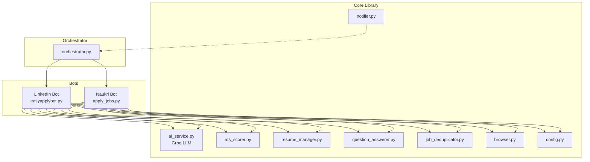

# JobApplierBot 🤖

**Automated multi-platform job application bot** that applies to jobs on **LinkedIn** and **Naukri** with AI-powered resume tailoring, ATS scoring, and smart form filling.

## ✨ Features

| Feature | Description |
|---------|-------------|
| **Multi-Platform** | Apply on LinkedIn (Easy Apply) and Naukri simultaneously |
| **AI-Powered Q&A** | Answers application questions using Groq LLM (Llama 3.3 70B) |
| **ATS Scoring** | Calculates resume-JD match score before applying |
| **Resume Tailoring** | Auto-generates tailored resumes with missing keywords |
| **Job Deduplication** | Cross-platform dedup prevents duplicate applications |
| **Smart Filtering** | Blacklists, experience level filters, relevance scoring |
| **Referral Requests** | Auto-sends connection requests on LinkedIn (optional) |
| **Email to HR** | Sends resume + cover letter to HR emails |
| **Cover Letter Gen** | AI-generated personalized cover letters |
| **Notifications** | Email alerts for applications and daily summaries |
| **Analytics Dashboard** | FastAPI-based stats API |
| **Docker Support** | Full containerization with docker-compose |

## 🏗️ Architecture



## 🚀 Quick Start

### 1. Clone & Install

```bash
git clone https://github.com/your-repo/JobApplierBot.git
cd JobApplierBot
pip install -r requirements.txt
```

### 2. Configure

```bash
# Copy the example env file
cp .env.example .env

# Edit with your credentials
notepad .env  # Windows
# nano .env   # Linux/Mac
```

Required values in `.env`:
```env
GROQ_API_KEY=gsk_your_key_here       # Get from console.groq.com
LINKEDIN_USERNAME=your@email.com
LINKEDIN_PASSWORD=your_password
LINKEDIN_PHONE=1234567890
NAUKRI_EMAIL=your@email.com
NAUKRI_PASSWORD=your_password
RESUME_PATH=C:/path/to/resume.pdf
```

### 3. Run

```bash
# Run both platforms
python orchestrator.py --platform both

# LinkedIn only
python orchestrator.py --platform linkedin

# Naukri only
python orchestrator.py --platform naukri

# Dry run (preview without applying)
python orchestrator.py --dry-run

# Show statistics
python orchestrator.py --mode stats

# Start dashboard API
python orchestrator.py --mode dashboard
```

### Docker

```bash
# Build and run
docker-compose up job-bot

# LinkedIn only
docker-compose --profile linkedin up job-bot-linkedin

# Dashboard
docker-compose --profile dashboard up dashboard
```

## 📁 Project Structure

```
JobApplierBot/
├── .env.example          # Environment template
├── .gitignore            # Git ignore rules
├── requirements.txt      # Python dependencies
├── orchestrator.py       # Unified CLI entry point
├── Dockerfile            # Container build
├── docker-compose.yml    # Multi-service deployment
│
├── core/                 # Shared core library
│   ├── ai_service.py     # Groq LLM integration
│   ├── ats_scorer.py     # ATS scoring engine
│   ├── resume_manager.py # Resume parsing & tailoring
│   ├── question_answerer.py # Smart Q&A system
│   ├── job_deduplicator.py  # Cross-platform dedup
│   ├── notifier.py       # Email notifications
│   ├── browser.py        # Anti-detection Chrome
│   └── config.py         # Unified config loader
│
├── Linkedin/             # LinkedIn Easy Apply Bot
│   └── LinkedIn-Easy-Apply-Bot/
│       ├── easyapplybot.py
│       └── config.yaml
│
├── naukari/              # Naukri Easy Apply Bot
│   └── Naukari-Easy-Apply-Bot/
│       ├── apply_jobs.py
│       └── Config.yaml
│
└── tests/                # Test suite
    ├── test_ats_scorer.py
    ├── test_question_answerer.py
    ├── test_resume_manager.py
    ├── test_config.py
    └── test_job_deduplicator.py
```

## 🧪 Testing

```bash
# Run all tests
pytest tests/ -v

# Run with coverage
pytest tests/ -v --cov=core
```

## ⚙️ Configuration

### YAML Config (optional)

You can also use a YAML config file alongside `.env`:

```yaml
# config.yaml
groq:
  model: llama-3.3-70b-versatile

ats:
  target_score: 80
  min_to_apply: 60

positions:
  - Software Engineer
  - Java Developer

locations:
  - Bengaluru
  - Remote

experience_level:
  - 2  # Associate
  - 3  # Mid-Senior

naukri:
  role: java developer
  location: bengaluru
  max_applications: 10
```

### Priority Order

Environment variables (`.env`) override YAML values, which override defaults.

## 🔒 Security

- **Never commit `.env` or `config.yaml`** — they're in `.gitignore`
- API keys are loaded from environment variables
- No credentials in source code
- Use `.env.example` as a template

## 📊 AI Provider: Groq

This project uses [Groq](https://groq.com) for AI inference — the fastest LLM API available.

- **Model**: `llama-3.3-70b-versatile` (default)
- **Features**: JD analysis, cover letters, form Q&A, relevance scoring
- **Get API Key**: [console.groq.com](https://console.groq.com)
- **Free tier**: Available with rate limits

## 📄 License

MIT License — see [LICENSE](LICENSE) for details.
